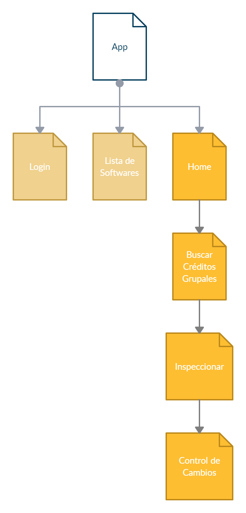
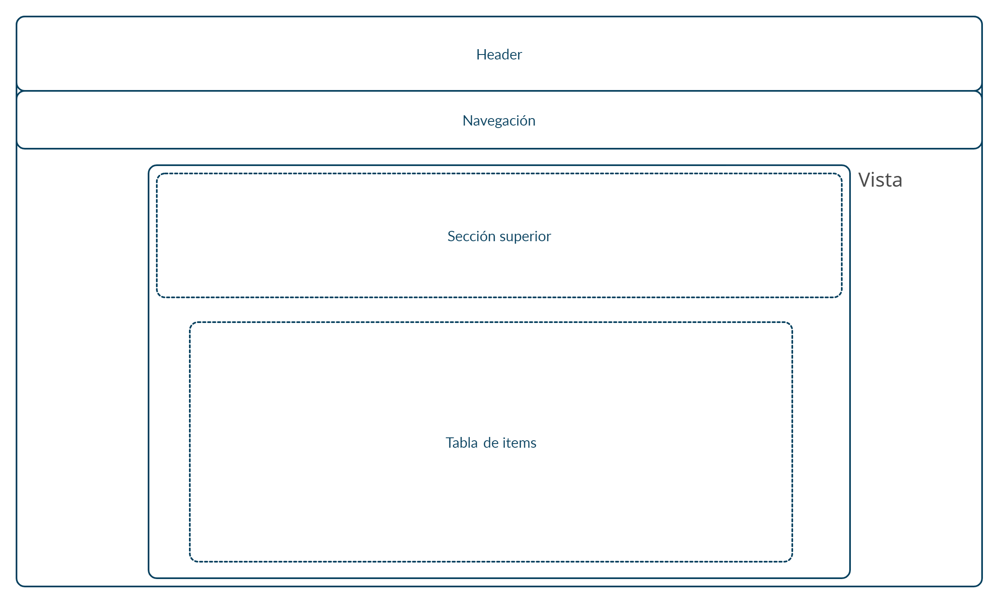
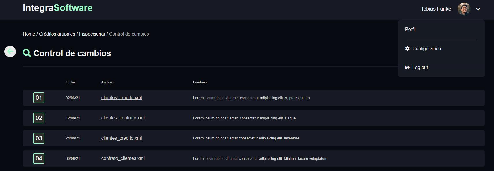
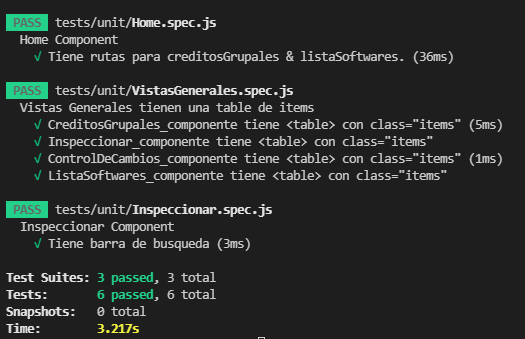
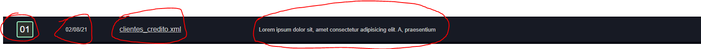
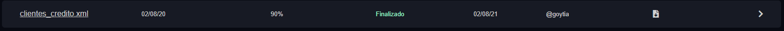
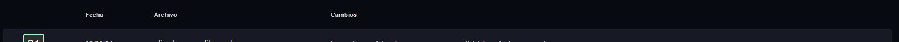

<h1 align='center'>
  PRUEBA DE PROGRAMACIÓN FRONTEND
</h1>

<br>
<p>
  La aplicación es desarrollada en Vue.js, no se utilizó ninguna librería o preprocesadores de estilos. Se usó font-awesome para para los íconos. Y se utilizaron estas librerías: <a href='https://router.vuejs.org/'>vue-router</a> para el routing, <a href='https://www.npmjs.com/package/axios'>axios</a> para http requests. No se utilizó ninguna herramienta de manejo de estados. 
</p>

## Instrucciones para ejecutar

Descarga y descomprime el zip o clona el repo.

Abre la consola, CMD o bash en el directorio donde está el proyecto. (.../mobilendervuetask-master)

Para asegura que la consola esté abierta en el directorio del proyecto. Copia el directorio de tu carpeta mobilendervuetask-master y escribe esto en la consola:
```bash
cd <directorio>
```
Ejemplo:
```bash
cd C:\descargas\mobilendervuetask
```


### Ejecuta los siguientes comandos.
(npm install puede tomar un buen tiempo instalando las dependencias)
```bash
npm install
npm run serve
```
### Después de la espera, esto aparecerá en la consola:
```bash
App running at:
  - Local:   http://localhost:8080/
  - Network: http://192.168.1.13:8080/
```
### Abre el navegador y entra a una de esas direcciones.
<br>

## También puedes ver el demo online aquí: <a href='https://frontendui.netlify.app/#/'>frontendui.netlify.app/</a>
<br>

# Detalles

### La aplicación tiene 6 vistas, organizadas así:



### Este es el layout/diseño de la aplicación:



<h2>Vistas</h2>

Al navegar por diferentes vistas, lo único que cambiaría en la aplicación es la sección de vista, donde todas nuestras vistas tienen un diseño similar. Todas las vistas tienen una sección superior que contiene: título y/o botones, barras de búsqueda, etc. Debajo de sección superior está la tabla de ítems, donde cada ítem es un componente reutilizable llamado RowItem para todas las vistas.

### Por lo tanto, el componente de las vistas tienen un template más o menos así:

```js
<div class="vista">
    <div class="topbar">
      …
    </div>
    <table class="items">
      <RowItem
        v-for="(item) in mis_items "
        :data="item"
        :fractions="[1, 3, 14, 1]"
      />
    </table>
</div>
```

`Login` es la única vista que no tiene este diseño, que consite en un simple form que toma input, y tiene la funcionalidad de loguear.
Los componentes vistas de `Crédito Grupales`, `Control de cambios`, y `Listado de Softwares` crean sus items con los datos consumiendo de un backend, en este caso, es un restful API falso (https://my-json-server.typicode.com/canhuiHuang/vuetask/) que tiene los datos mostrado en las imágenes del documento de PRUEBA DE PROGRAMACIÓN FRONTEND para hacer GET requests y simular POST requests. Se usó la librería axios para hacer los http calls.
Se puede simular el logueo con el `correo` de cualquier usuario de https://reqres.in/ con cualquier contraseña. La sesión es persistente con la información guardada en localStorage.
Al estar logueado, se podrá desloguearse con el menú desplegable del component de perfil en la parte superior derecha.


<br>

### Se usó vue-utils, vue-jest y se realizó pruebas unitarias simples del UI


<br>

# Componente `RowItem`

El componente RowItem toma 2 `props` obligatorios: `data` y `fraction`, y 2 opciones: `labelMode` y `link`.

`data` es una lista de elementos td:


Y cada element td es un objecto:

```js
{
        type: "text",
        content: "02/08/21",
        src: "",
        classes: "no_left_padding big_font bright_font",
        action: null,
        label: "Fecha",
}
```

### RowItem tomará esta lista y creará un row rellenado con esos elementos td.



### El objecto td

| Key     | value<type>: args                                         | Description                                                                                                            |
| ------- | --------------------------------------------------------- | ---------------------------------------------------------------------------------------------------------------------- |
| type    | `<String>`: “text”, “numberBox”, “file”, “imgUrl”, “icon” | Tipo de contenido del td.                                                                                              |
| content | `<String>`                                                | Es el contenido de `text`, el nombre del `file`, el numero de `numberBox`, y las `classes` para el icono font-awesome. |
| src     | `<String>`                                                | El link de la imagen, en caso de type: `“imgUrl”`.                                                                     |
| classes | `<String>`                                                | Personaliza posición o tamaño del contenido con args/classes como `no_left_padding` o `big_font`.                      |
| action  | `Function`                                                | Por el momento, esto no hace nada, pero está reservado para accionar funciones al momento de interactuar con este td.  |
| label   | `<String>`                                                | El label de este td.                                                                                                   |

### Props de RowItem

| Prop `Mandatorio` | value<type>        | Description                                                                                                                                                                                                                                 |
| ----------------- | ------------------ | ------------------------------------------------------------------------------------------------------------------------------------------------------------------------------------------------------------------------------------------- |
| data              | `List<objecto td>` | RowItem tomará esta lista y creará un row rellenado con esos elementos td.                                                                                                                                                                  |
| fraction          | `List<number>`     | Fraction es una lista de números que indica la proporción del ancho del row que cada elemento td de la lista data va a tomar. La lista fraction tiene que tener el mismo tamaño (fractionList.length === data.length) que la lista de data. |

<br>


Por ejemplo, para un crear un RowItem de proporciones similares, la lista fraction sería: `[1,2,5,12]`.
<br>

| Prop `Opcional` | value<type>                  | Description                                                                                                             |
| --------------- | ---------------------------- | ----------------------------------------------------------------------------------------------------------------------- |
| labelMode       | `<boolean>` default: `false` | Al pasar labelMode: `true`, se creara un RowItem de labels.  |
| link            | `<String>` default: `""`     | Al pasar un link, RowItem sera clickeable, y redireccionara el browser al link indicado.                                |


Aplicación hecho por Canhui Huang.
